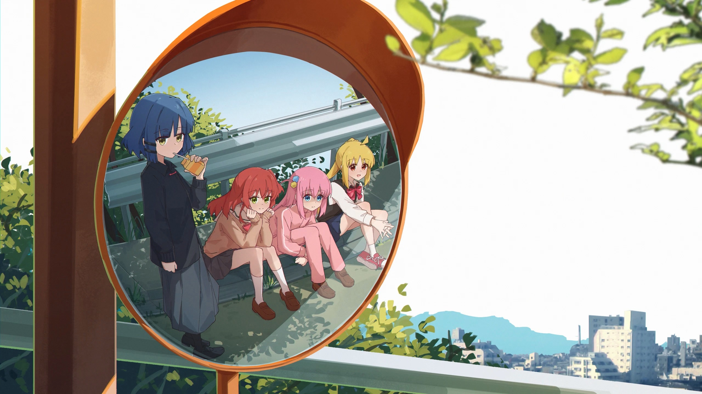

## Hi there 🍭🍭🍭

<!-- 动态打字效果 -->

  

<!--  播放器  -->
| 🎵 Now Playing👻👻👻🎃🎃🎃<code></code> | Ciallo～(∠・ω< )⌒★|
| ------------------------------------------------------------------------------------------------------------------------------ | ---------------------------------------------------------- |
|  |  |
<!--  卡片  -->
|  |  |
| ------------- | ------------- |
<!--

  
   

-->
### Top Repositories

<!--  贪吃蛇 -->
<picture>
  <source media="(prefers-color-scheme: dark)" srcset="https://raw.githubusercontent.com/Anthony-hcy/Anthony-hcy/output/github-contribution-grid-snake-dark.svg">
  <source media="(prefers-color-scheme: light)" srcset="https://raw.githubusercontent.com/Anthony-hcy/Anthony-hcy/output/github-contribution-grid-snake.svg">
  
</picture>

<a href="https://github.com/songquanpeng/stats-cards">

  
   

</a>

<!--
**Anthony-hcy/Anthony-hcy** is a ✨ _special_ ✨ repository because its `README.md` (this file) appears on your GitHub profile.

Here are some ideas to get you started:

- 🔭 I’m currently working on ...
- 🌱 I’m currently learning ...
- 👯 I’m looking to collaborate on ...
- 🤔 I’m looking for help with ...
- 💬 Ask me about ...
- 📫 How to reach me: ...
- 😄 Pronouns: ...
- ⚡ Fun fact: ...
-->
